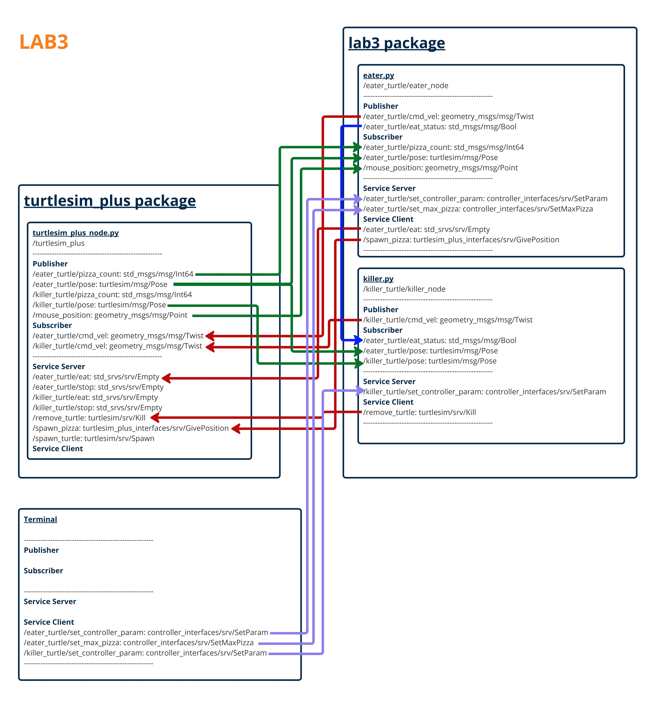

# LAB3 - Eater vs. Killer: Spawn–Forage–Pursuit (SFP) with RViz2 and Turtlesim+

## Table of Contents
- [Project Overview](#project-overview)
- [System Architecture](#system-architecture)
- [Requirements](#requirements)
- [Installation](#installation)
- [Usage](#usage)

## Project Overview

This project implements an interactive multi-node ROS 2 simulation using turtlesim_plus.
The system demonstrates autonomous behaviors including pizza spawning, foraging, evasion,
and pursuit. Two turtles, eater and killer, operate under different modes and
communicate through topics, services, and parameters to coordinate their behaviors.

This project is developed for FRA502 LAB3 and follows the required architecture,
interfaces, and launch configuration specified in the assignment.

## System Architecture



The system consists of the following main components:

- **turtlesim_plus_node**  
  Provides the simulation environment, pizza spawning service, and turtle lifecycle management.

- **eater node**  
  Handles pizza spawning, autonomous foraging, and evasion behavior.

- **killer node**  
  Waits until the eater finishes all pizzas, then pursues and removes the eater.

Nodes communicate via ROS 2 topics, services, and parameters.

## Node Descriptions

### 1. eater_node (`eater.py`)

**Description**  
The eater node controls a turtle that responds to mouse clicks, spawns pizzas,
eats them sequentially, and switches behavior once all pizzas are consumed.

**Main Responsibilities**
- Navigate the turtle using pose feedback
- Accept mouse click targets from `/mouse_position`
- Spawn pizzas at clicked locations using `/spawn_pizza`
- Eat pizzas in FIFO order using `/XXXX/eat`
- Publish eating status to inform the killer node
- Switch between **Forage Mode** and **Evade Mode**

**Publishers**

| Topic | Type | Description |
|------|------|-------------|
| `/XXXX/cmd_vel` | geometry_msgs/msg/Twist | Velocity command for eater turtle |
| `/XXXX/eat_status` | std_msgs/msg/Bool | Indicates whether eater is still eating pizzas |

**Subscribers**

| Topic | Type | Description |
|------|------|-------------|
| `/XXXX/pose` | turtlesim/msg/Pose | Current pose of eater |
| `/mouse_position` | geometry_msgs/msg/Point | Mouse click target |
| `/XXXX/pizza_count` | std_msgs/msg/Int64 | Number of pizzas eaten |

**Service Servers**

| Service | Type | Description |
|--------|------|-------------|
| `/XXXX/set_max_pizza` | controller_interfaces/srv/SetMaxPizza | Set maximum number of pizzas |
| `/XXXX/set_controller_param` | controller_interfaces/srv/SetParam | Configure controller gains |

**Service Clients**

| Service | Type | Description |
|--------|------|-------------|
| `/spawn_pizza` | turtlesim_plus_interfaces/srv/GivePosition | Spawn pizza |
| `/XXXX/eat` | std_srvs/srv/Empty | Eat a pizza |

---

### 2. killer_node (`killer.py`)

**Description**  
The killer node controls a turtle that remains idle while the eater is consuming pizzas.
Once all pizzas are eaten, it pursues the eater and removes it from the simulation.

**Main Responsibilities**
- Monitor eater eating status
- Track eater pose after hunt mode is activated
- Navigate toward the eater using feedback control
- Eliminate the eater when close enough
- Stop movement after successful capture

**Publishers**

| Topic | Type | Description |
|------|------|-------------|
| `/YYYY/cmd_vel` | geometry_msgs/msg/Twist | Velocity command for killer turtle |

**Subscribers**

| Topic | Type | Description |
|------|------|-------------|
| `/YYYY/pose` | turtlesim/msg/Pose | Killer turtle pose |
| `/XXXX/pose` | turtlesim/msg/Pose | Eater turtle pose |
| `/XXXX/eat_status` | std_msgs/msg/Bool | Eater eating status |

**Service Servers**

| Service | Type | Description |
|--------|------|-------------|
| `/YYYY/set_controller_param` | controller_interfaces/srv/SetParam | Configure controller gains |

**Service Clients**

| Service | Type | Description |
|--------|------|-------------|
| `/remove_turtle` | turtlesim/srv/Kill | Remove eater turtle |

---

## Topics / Services / Parameters

### Topics
- `/XXXX/cmd_vel` – velocity command for eater
- `/YYYY/cmd_vel` – velocity command for killer
- `/XXXX/pose` – eater pose
- `/YYYY/pose` – killer pose
- `/XXXX/eat_status` – eater eating state
- `/mouse_position` – mouse click position

### Services
- `/spawn_pizza` – spawn pizza at a given position
- `/XXXX/eat` – eater eats pizza
- `/remove_turtle` – kill a turtle
- `/XXXX/set_max_pizza` – set max pizza count
- `/XXXX/set_controller_param` – set eater controller gains
- `/YYYY/set_controller_param` – set killer controller gains

### Parameters
- `sampling_frequency` (double, default: 100.0 Hz)
- `eater_name` (killer node parameter)

---

## Requirements

### Software
- ROS 2 Humble
- Python 3
- turtlesim_plus
- numpy

### Workspace Structure

```bash
FRA502-LAB-6616/
├── src
│ ├── controller_interfaces
│ │ ├── CMakeLists.txt
│ │ ├── LICENSE
│ │ ├── package.xml
│ │ └── srv
│ │     ├── SetMaxPizza.srv
│ │     └── SetParam.srv
│ ├── lab3
│ │ ├── CMakeLists.txt
│ │ ├── include/
│ │ ├── lab3/
│ │ ├── launch
│ │ │   └── launch.py
│ │ ├── package.xml
│ │ ├── scripts
│ │ │   ├── dummy_script.py
│ │ │   ├── eater.py
│ │ │   └── killer.py
│ │ └── src/
│ └── turtlesim_plus
└── README.md
```

## Installation

**1. Clone repository**

```bash
cd ~
git clone -b lab3 https://github.com/Natthanichathan/FRA502-LAB-6616.git
```

**2. Build workspace**

```bash
cd ~/FRA502-LAB-6616
colcon build
source install/setup.bash
```

## Usage

**1.** Run the full system using the launch file:

```bash
ros2 launch lab3 launch.py
```

You can configure parameters such as sampling_frequency,
eater_name, and namespaces directly from the launch file.

**2.** (Optional) Set max pizza

```bash
ros2 run rqt_service_caller rqt_service_caller
```
select service as a ```/XXXX/set_max_pizza``` then call max_pizza as you desire.

or you can call service from terminal

```bash
ros2 service call /XXXX/set_max_pizza controller_interfaces/srv/SetMaxPizza 'max_pizza: 0' 
```

**3.** (Optional) Set kp

```bash
ros2 run rqt_service_caller rqt_service_caller
```

select service as a ```/MMMM/set_controller_param``` then call kp of each turtle as you desire while you can adjust kp_linear and kp_angular

or you can call service from terminal

```bash
ros2 service call /MMMM/set_controller_param controller_interfaces/srv/SetParam 'kp_linear: 0.0
kp_angular: 0.0'
```

## Notes

- The eater must finish all pizzas before the killer begins pursuit.

- The killer stops moving after successfully killing the eater.

- All topics and services respect the namespace defined in the launch file.