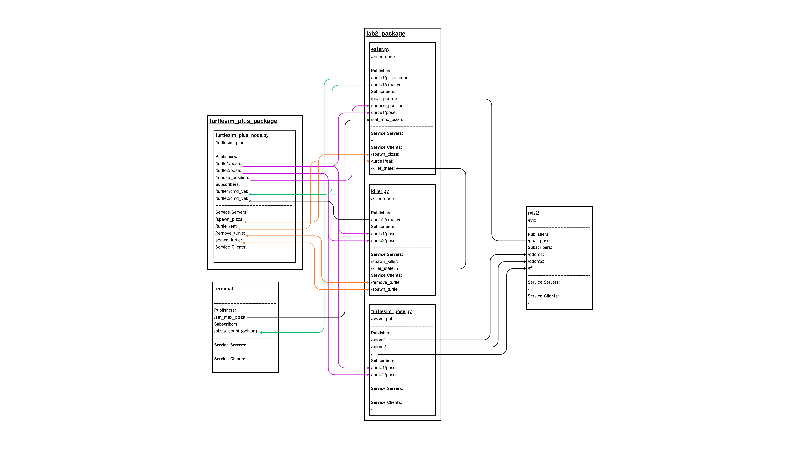

# LAB2 - Eater vs. Killer: Spawn–Forage–Pursuit (SFP) with RViz2 and Turtlesim+

An extended interactive simulation using turtlesim_plus, showing behaviors such as pizza spawning, autonomous foraging, evasion, and pursuit mechanics. The system integrates custom nodes, services, topics, and RViz2 visualization for complete interaction.

## Table of Contents
- [Project Overview](#project-overview)
- [System Architecture](#system-architecture)
- [Requirements](#requirements)
- [Installation](#installation)
- [Usage](#usage)

## Project Overview

This project implements a multi-agent interactive simulation where two turtles operate with different autonomous behaviors:

**1. Eater (turtle1)**

* Moves to user-clicked positions and automatically spawns pizzas at those clicked locations.

* Forages pizzas in the order they were created using ```/spawn_pizza``` and ```/turtle1/eat``` services.

* Publishes its progress via ```/turtle1/pizza_count```.

* When all pizzas are eaten (```max_pizza``` controlled via ```/set_max_pizza```), the eater enters evasion mode, moving only to mouse clicks without spawning pizzas.

* Notifies the killer to begin hunting through ```/killer_state```.

**2. Killer (turtle2)**

* Initially idle and can be spawned via ```/spawn_killer```.

* Begins pursuit behavior when eater signals hunt mode.

* Follows real-time pose of turtle1 and attempts to capture it.

* When near turtle1 (< 0.5 distance), the killer removes turtle1 using /remove_turtle.

**3. Turtlesim Pose Node**

* Converts native turtlesim poses into ROS2-compatible localization data:

* Publishes ```/odom1``` and ```/odom2``` odometry messages

* Broadcasts TF transforms (```odom → turtle1```, ```odom → turtle2```)

* Maps turtlesim coordinates to RViz2’s 10×10 m world

* Ensures full RViz visualization compatibility

* This system demonstrates path tracking, autonomous behavior, pursuit logic, TF operations, ROS2 services, and multi-node coordination.

## System Architecture



The diagram shows all communication links between:

* ```eater_node```

* ```killer_node```

* ```turtlesim_pose_node```

* ```turtlesim_plus_node```

* RViz2

* Terminal publishers (```/set_max_pizza```, etc.)

### Nodes Descriptions
---

**1. eater_node** (eater.py)

**Main Responsibilities**

* Navigate turtle1 toward pizzas and goals

* Respond to mouse clicks and RViz2 goal poses

* Spawn pizzas at clicked locations (/spawn_pizza, service client)

* Eat pizzas in FIFO order

* Publish pizza-eaten count

* Send hunt-state signal to killer

* Switch between Foraging Mode and Evasion Mode

**Publishers**

| **Topic** | **Type** | **Description** |
|:---: | :---: | :---: |
| ```/turtle1/cmd_vel``` | geometry_msgs/msg/Twist | Velocity commands for turtle1|
|```/turtle1/pizza_count```| std_msgs/msg/Int64 | Number of pizzas eaten |

**Subscriber**

| **Topic** | **Type** | **Description** |
|:---: | :---: | :---: |
|```/turtle1/pose```| turtlesim/msg/Pose | Pose tracking for navigation |
| ```/mouse_position``` | geometry_msgs/msg/Point | User-clicked goal and pizza spawn |
| ```/goal_pose``` | geometry_msgs/msg/PoseStamped | RViz2-clicked goal → turtlesim coordinates |
 ```/set_max_pizza``` | std_msgs/msg/Int64 | Limits total pizzas

**Service Clients**
| **Service** | **Type** | **Description** |
|:---: | :---: | :---: |
| ```/spawn_pizza```  | turtlesim_plus_interfaces/srv/GivePosition | Spawn pizza at clicked point |
| ```/turtle1/eat``` | std_srvs/srv/Empty | Eat the current pizza |
| ```/killer_state``` | std_srvs/srv/SetBool | Notify killer about hunt mode |

**2. killer_node** (killer.py)

**Main Responsibilities**

- Pursue the eater after receiving hunt signal

- Perform kill action when within proximity

- Spawn itself when requested

- Idle when not in hunt mode

**Publishers**

| **Topic** | **Type** | **Description** |
|:---: | :---: | :---: |
| ```/turtle2/cmd_vel``` | geometry_msgs/msg/Twist | Movement control of killer |

**Subscriber**

| **Topic** | **Type** | **Description** |
|:---: | :---: | :---: |
|```/turtle1/pose``` | turtlesim/msg/Pose | Target for pursuit |
|```/turtle2/pose``` | turtlesim/msg/Pose | Own position tracking |

**Service Servers**
| **Service** | **Type** | **Description** |
|:---: | :---: | :---: |
| ```/killer_state``` | std_srvs/srv/SetBool | Enable/disable hunt mode |
| ```/spawn_killer``` | std_srvs/srv/SetBool | Spawn turtle2 in turtlesim |

**Service Clients**
| **Service** | **Type** | **Description** |
|:---: | :---: | :---: |
| ```/remove_turtle``` | turtlesim/srv/Kill | Kill turtle1 |
| ```/spawn_turtle``` | turtlesim/srv/Spawn | Spawn turtle2 |

**3. turtlesim_pose_node** (turtlesim_pose.py)

**Main Responsibilities**

- Convert turtlesim poses to /odom1 and /odom2

- Broadcast TF transforms for both turtles

- Scale turtlesim coordinates to a 10×10 m RViz2 environment

**Publishers**

| **Topic** | **Type** | **Description** |
|:---: | :---: | :---: |
| ```/odom1``` | nav_msgs/msg/Odometry | Position turtle1 in the odom world frame |
| ```/odom2``` | nav_msgs/msg/Odometry | Position turtle2 in the odom world frame |

**Subscriber**

| **Topic** | **Type** | **Description** |
|:---: | :---: | :---: |
|```/turtle1/pose``` | turtlesim/msg/Pose | Monitor turtle1 position and orientation |
|```/turtle2/pose``` | turtlesim/msg/Pose | Monitor turtle2 position and orientation |

### Topics / Services / Parameters Descriptions
---

#### Topics

**Publishers**

- ```/turtle1/cmd_vel``` [geometry_msgs/msg/Twist] - control turtle1

- ```/turtle2/cmd_vel``` [geometry_msgs/msg/Twist] - control turtle2

- ```/turtle1/pizza_count``` [std_msgs/msg/Int64] - pizza status

- ```/odom1```, ```/odom2``` [nav_msgs/msg/Odometry] - odometry for RViz2

**Subscribers**

- ```/turtle1/pose```, ```/turtle2/pose``` [turtlesim/msg/Pose] - turtle position on turtlesim 
 
- ```/mouse_position``` [geometry_msgs/msg/Point] - mouse click position on turtlesim

- ```/goal_pose``` [geometry_msgs/msg/PoseStamped] - goal pose from RViz

- ```/set_max_pizza``` [std_msgs/msg/Int64] - set max pizza

**Service Servers**

- ```/spawn_killer``` [std_srvs/srv/SetBool] - Spawn turtle2
- ```/killer_state``` [std_srvs/srv/SetBool] - Activate hunt mode

**Service Clients**

- ```/spawn_turtle``` [turtlesim/srv/Spawn] - Spawn turtle
- ```/spawn_pizza``` [turtlesim_plus_interfaces/srv/GivePosition] - Pizza spawning
- ```/turtle1/eat``` std_srvs/srv/Empty - Eat  pizza
- ```/killer_state``` [std_srvs/srv/SetBool] - Activate hunt mode

## Requirements

**Software**

- ROS2 Humble

- Python 3

- turtlesim_plus package

- numpy (included in Python std env)

**Repository Structure**

```css
FRA502-LAB-6616/
│── src/
│   ├── lab2/
│   │   ├── include/
│   │   ├── lab2/
│   │   ├── scripts/
│   │   │   ├── dummy_script.py
│   │   │   ├── eater.py
│   │   │   ├── killer.py
│   │   │   └── turtlesim_pose.py
│   │   ├── src/
│   │   ├── CMakeLists.txt
│   │   └── package.xml
│   ├── turtlesim_plus/
│   └── lab2.rviz
│── Architecture.png
└── README.md
```

## Installation

**1. Clone repository**

```bash
cd ~
git clone -b lab2 https://github.com/Natthanichathan/FRA502-LAB-6616.git
```

**2. Build workspace**

```bash
cd ~/FRA502-LAB-6616
colcon build
source install/setup.bash
```

## Usage

**0. Source workspace** (**must do** evrytime that open new terminal)

```bash
cd ~/FRA502-LAB-6616 && . install/setup.bash
```


**1. Run turtlesim_plus**

```bash
ros2 run turtlesim_plus turtlesim_plus_node
```

**2. Run pose mapper**

```bash
ros2 run lab2 turtlesim_pose.py
```

**3. Run eater**

```bash
ros2 run lab2 eater.py
```

**4. Run killer**

```bash
ros2 run lab2 killer.py
```

**5. (Optional) Set max pizza**

```bash
ros2 topic pub /set_max_pizza std_msgs/Int64 "data: 10"
```

**6. Spawn killer manually**

```bash
ros2 run rqt_service_caller rqt_service_caller
```
select service as a ```/spawn_turtle``` then call name as a 'turtle2'

or you can spawn killer from terminal

```bash
ros2 service call /spawn_killer std_srvs/srv/SetBool "{data: true}"
```

**7. Visualize in RViz2**

```bash
rviz2 -d src/lab2.rviz
```